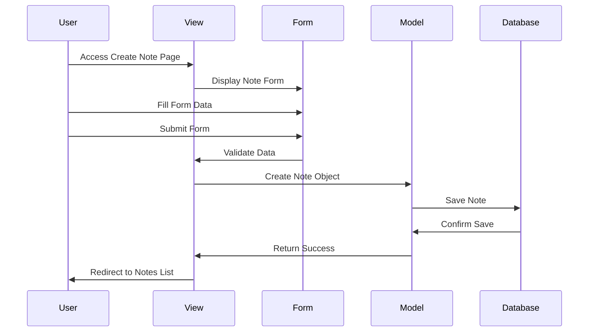
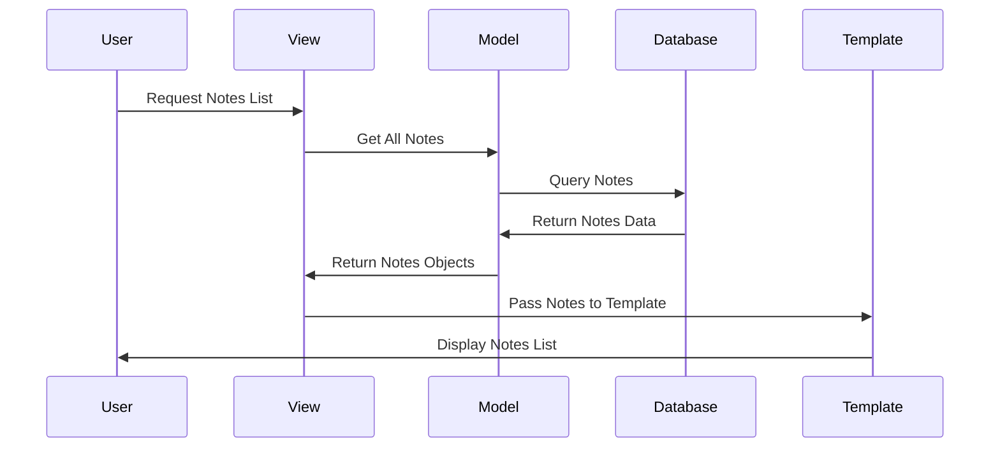
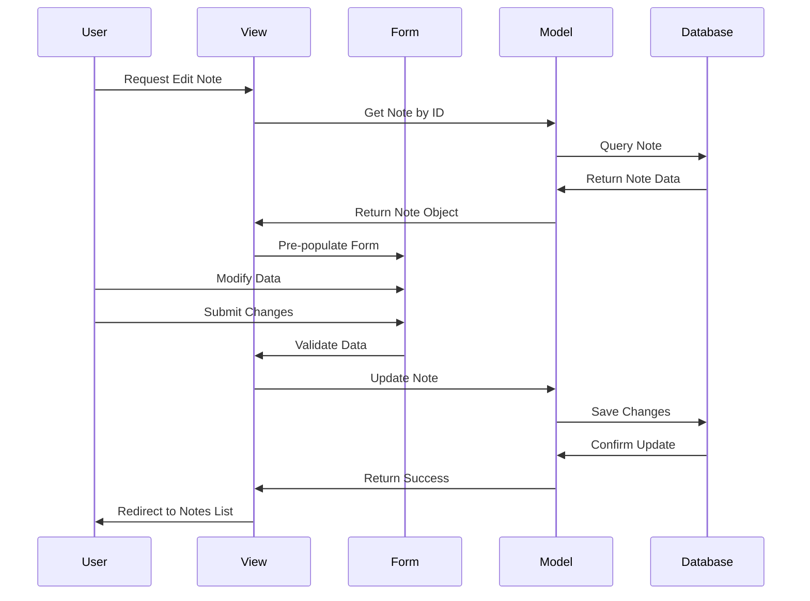
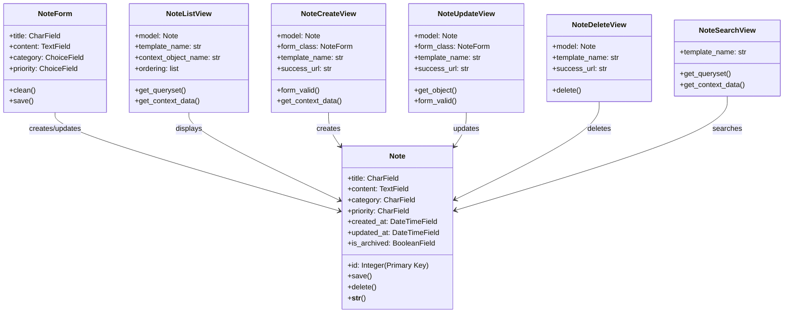

# Sticky Notes Application - Design Documentation

## 1. Use Case Diagram

```mermaid
graph TD
    User((User))
    
    User --> UC1[Create Note]
    User --> UC2[View Notes]
    User --> UC3[Edit Note]
    User --> UC4[Delete Note]
    User --> UC5[Search Notes]
    User --> UC6[Filter Notes by Category]
    
    UC1 --> UC1_1[Enter Title]
    UC1 --> UC1_2[Enter Content]
    UC1 --> UC1_3[Select Category]
    UC1 --> UC1_4[Set Priority]
    UC1 --> UC1_5[Save Note]
    
    UC2 --> UC2_1[View All Notes]
    UC2 --> UC2_2[View Note Details]
    UC2 --> UC2_3[Sort Notes]
    
    UC3 --> UC3_1[Modify Title]
    UC3 --> UC3_2[Modify Content]
    UC3 --> UC3_3[Change Category]
    UC3 --> UC3_4[Update Priority]
    UC3 --> UC3_5[Save Changes]
    
    UC4 --> UC4_1[Confirm Deletion]
    UC4 --> UC4_2[Remove Note]
    
    UC5 --> UC5_1[Search by Title]
    UC5 --> UC5_2[Search by Content]
    UC5 --> UC5_3[View Search Results]
    
    UC6 --> UC6_1[Select Category Filter]
    UC6 --> UC6_2[View Filtered Notes]
```



## 2. Sequence Diagram

### Create Note Sequence


### View Notes Sequence


### Edit Note Sequence


## 3. Class Diagram



## 4. Database Schema

### Note Table
| Field | Type | Constraints | Description |
|-------|------|-------------|-------------|
| id | Integer | Primary Key, Auto Increment | Unique identifier |
| title | CharField | Max Length: 200, Not Null | Note title |
| content | TextField | Not Null | Note content |
| category | CharField | Max Length: 50, Choices | Note category |
| priority | CharField | Max Length: 20, Choices | Priority level |
| created_at | DateTimeField | Auto Now Add | Creation timestamp |
| updated_at | DateTimeField | Auto Now | Last update timestamp |
| is_archived | BooleanField | Default: False | Archive status |

## 5. URL Structure

```
/                           - Home/Notes List
/note/new/                  - Create New Note
/note/<id>/                 - View Note Details
/note/<id>/edit/            - Edit Note
/note/<id>/delete/          - Delete Note
/search/                    - Search Notes
/category/<category>/       - Filter by Category
```

## 6. Template Structure

```
templates/
├── base.html              - Base template
├── notes/
│   ├── note_list.html     - Notes list view
│   ├── note_detail.html   - Note detail view
│   ├── note_form.html     - Create/Edit form
│   ├── note_confirm_delete.html - Delete confirmation
│   └── search_results.html - Search results
└── static/
    ├── css/
    │   └── style.css      - Main stylesheet
    └── js/
        └── main.js        - JavaScript functionality
```

## 7. Features Overview

### Core Features
- **CRUD Operations**: Create, Read, Update, Delete notes
- **Search Functionality**: Search notes by title and content
- **Category Filtering**: Filter notes by category
- **Priority Levels**: Set and display note priorities
- **Responsive Design**: Mobile-friendly interface
- **Archive Functionality**: Archive/unarchive notes

### Technical Features
- **Django MVT Architecture**: Model-View-Template pattern
- **Form Validation**: Client and server-side validation
- **Static File Management**: CSS and JavaScript organization
- **Database Migrations**: Proper schema management
- **PEP 8 Compliance**: Clean, readable code
- **Security**: CSRF protection, input sanitization
